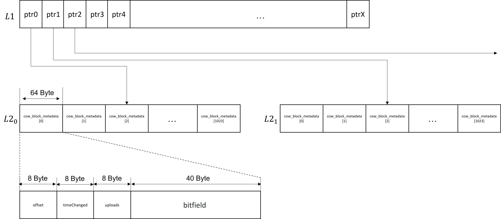
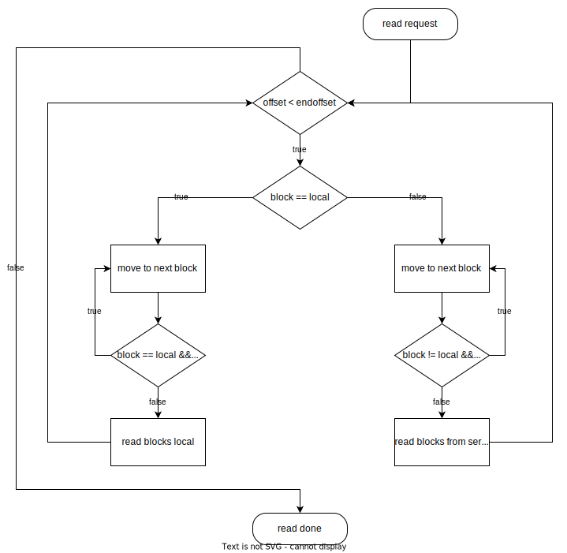

# Fuse Copy on Write (CoW)

### Table of Contents
1. [Introduction](#introduction)
2. [Usage](#usage)
3. [Implementation Details](#implementation-details)
4. [REST Api](#rest-api)


# Introduction

This extension of the fuse dnbd3 client makes it possible to mount images in a writable way. The changes are saved in a separate file ) on the client computer (also called Copy on Write, cow for short). These changes are uploaded to the cow server in the background. As soon as the user unmounts the image, all remaining changes are uploaded. Once all have been uploaded, the changes can be merged into a copy of the original image on the cow server (this can be set in the start parameters).


A typical use case is updating or adding software to an existing image.

# Usage

### New Parameters
- `-c <path>` Enables the cow functionality. The `path` parameter sets the path for the temporary `meta` and `data` files in which the changes are saved.
- `-C <address>` sets the address of the cow server. The Cow server is responsible for merging the original image with the client's changes.

- `- L <path>` Similar to `-c <path>`, but instead of creating a new session, an existing one is loaded from the specified path.
- `-m` the client requests a merge after the image has been unmounted and all changes have been uploaded.

- `--cowStatFile` creates a status file at the same location as the data and meta file. The file contains information about the current session, for more information see [here](#status).
- `--cowStatStdout` similar to `--cowStatFile` but the information will be printed in the stdout.

Example parameters for creating a new cow session:
```
./dnbd3-fuse "/home/user/VMs/mount" -f -h localhost -i imagename -c "/home/user/temp" -C "192.168.178.20:5000" --cowStatStdout -m

```

# Implementation Details


## Data structure

The data structure is divided into two main parts. The actual data of the writing on the image and the corresponding metadata. It is also important to distinguish between a dnbd3 block, which is 4096 bytes in size, and a cow cluster, which combines 320 dnbd3 blocks. A cow cluster has a `cow_l2_entry_t` structure in its according l2 table that contains the corresponding metadata.  The metadata is used to determine if a dnbd3 block has been written to, where that block is stored in the `data` file, when it was last modified and when it was uploaded. But more on this later.


### Metadata



The metadata file, which ultimately stores the `cow_l2_entry_t` structs, contains a layer 1 (L1) and a layer 2 (L2) table for looking up the struct, which ultimately points to the actual data in the data file.
The entire L1 table is initialised at the beginning and cannot be resized, therefore the size of the L1 table limits the maximum size of the image.
The L2 tables are created dynamically as needed. So at the beginning, all L1 pointers are invalid (-1).

The L2 tables contain 1024 `cow_l2_entry_t` structs each. An L2 table is created as soon as any data is written to any offset in the image that corresponds to the range it covers, which is a span of 1024 * 320 * 4096 bytes.

```C
typedef struct cow_l2_entry
{
	atomic_int_least64_t offset;
	atomic_uint_least64_t timeChanged;
	atomic_uint_least64_t uploads;
	atomic_char bitfield[40];
} cow_l2_entry_t;
```
Each `cow_l2_entry_t` contains a 40 byte, 320 bit bit-field. The bit-field indicates whether the corresponding dnbd3 block has been written locally. If, for example, the bit field begins with 01... the first 4096 bytes contain no data and the next 4096 do.
So each `cow_l2_entry_t` stores the metadata for up to 320\*4096 bytes. The offset field is the offset into the data file where the corresponding data is stored. `timeChanged` contains the unix timestamp when the cluster was last written. It is 0 if it has never been changed or if the latest changes have already been uploaded.


For example, to get the `cow_l2_entry_t` for offset 4033085440, one would take L1[3], since
```
4033085440 / ( COW_FULL_L2_TABLE_DATA_SIZE ) ≈ 3.005
```

Then one would take the fifth `cow_l2_entry_t` in the L2 array because of
```
(4033085440 mod COW_FULL_L2_TABLE_DATA_SIZE) / COW_DATA_CLUSTER_SIZE = 5
```
Where:
```
COW_FULL_L2_TABLE_DATA_SIZE = 1024 * 320 * 4096
COW_DATA_CLUSTER_SIZE = 320 * 4096
```

Since the result is an integer, the offset refers to the first dnbd3 block in that cluster. Otherwise, the block number within the cluster be calculated via
```
(4033085440 % (320 * 4096)) / 4096
```
which is the index in the bit-field that tells whether the block has been written to the data file.


### Read Request

When a read request is made, for each dnbd3 block  block it is checked whether it already exists in the data file (i.e. has already been written to once). If so, it is read from the data file, otherwise it needs to be requested from the dnbd3 server. To increase performance, several subsequent blocks that are also local/non-local are combined into a larger reads from disk or requests from the server.



The diagram above is somewhat simplified for clarity. The server's read operations are asynchronous. This means that while iterating over the 4k blocks from the read request, it does not wait for a response from the server for blocks that are missing locally, but fires off a request to the dnbd3 server asynchronously, continuing to check the remaining blocks. As soon as all pending requests to the server are completed, the combined data is handed over to fuse, completing the request.
To keep track of pending requests, each request to the dnbd3 server increments the field `workCounter` in the according `cow_request_t` by one, and each time a request is completed, it is decreased by one. As soon as `workCounter` reaches `0`, all data is known to be fetched properly and assembled in a buffer that can be handed over to fuse.

### Write Request

If, in a write request, the beginning or end does not match a multiple of 4096, the beginning and/or end block must be padded if the accoding dnbd3 block hasn't been written to before.
This is because the granularity of the cow bit-field represents a full dnbd3 block of 4096 bytes, so we cannot write partial data to those blocks, as there is no mechanism to annotate which parts of the block have been written to, and which are still missing.
To work around this limitation, we need to fill the partial block's missing data with data from the dnbd3 server if it is still within the range of the original image size. If it is outside the original image size (because the image has grown), the missing bytes can simply be set to 0 and no request needs to be made.
The write request calculates the corresponding `cow_l2_entry_t` from the offset. If the corresponding `cow_l2_entry_t` does not yet exist, it is created. The data will be written to the data file, and the offset stored in `cow_l2_entry_t.offset`.
Then the corresponding bit in the bit-field is set and `timeChanged` is updated. If there is more data to write to the current cluster, the next `cow_l2_entry_t` is calculated and the above steps are repeated.
The variable `workCounter` is also used here to ensure that the padding of the data occurs before the fuse request returns.


### Background Cluster Upload

For uploading clusters, there is a background thread that periodically loops over all cow clusters and checks whether `timeChanged` is not 0 and the time difference between now and `timeChanged` is greater than `COW_MIN_UPLOAD_DELAY`.
If so, the entire cluster is uploaded. The `timeChanged` before the upload is remembered.
After the upload, `timeChanged` is set to 0 if it still has the same time as the temporarily stored one (if not, there was a change during the upload and it has to be uploaded again).
Once the image is unmounted, `COW_MIN_UPLOAD_DELAY` is ignored and all clusters that still have a `timeChanged` other than 0 are uploaded.
The upload is done via a [rest request](#/api/file/update).
There are two different limits for the number of parallel uploads in the [config/cow.h](#config-variables).

## Files

When a new CoW session is started, a new `meta`, `data` and, if so set in the command line arguments, a `status.txt` file is created.

### status

The file `status.txt` can be activated with the command line parameter `--cowStatFile`.

The file will contain the following:

```
uuid=<uuid>
state=backgroundUpload
inQueue=0
modifiedBlocks=0
idleClusters=0
totalClustersUploaded=0
activeUploads=0
ulspeed=0.00
```
- The `uuid` is the session uuid used by the Cow server to identify the session.

- The `status` is `backgroundUpload` when the image is still mounted and cow clusters are uploaded in the background.
It is `uploading` when the image has been unmounted and all clusters that have not yet been uploaded are uploaded.
It is `done` when the image has been unmounted and all clusters have been uploaded.
- `Queue` are the cow clusters that are currently being uploaded or are waiting for a free slot.
- `ModifiedClusters` are cow clusters that have changes that have not yet been uploaded to the server because the changes are too recent.
- `totalClustersUploaded` the total amount of cow clusters uploaded since the image was mounted.
- `activeUploads` is the number of clusters currently being uploaded.
- `ulspeed` the current upload speed in kb/s.

Once all clusters have been uploaded, the status is set to `done`.
If you define `COW_DUMP_BLOCK_UPLOADS`, a list of all clusters, sorted by the number of uploads, is copied to the status.txt file after the cluster upload is completed.

With the command line parameter `--cowStatStdout` the same output of the stats file will be printed in stdout.

### meta

The `meta` file contains the following header:
```C
// cowfile.h
typedef struct cowfile_metadata_header
{
	uint64_t magicValue;                    // 8byte
	atomic_uint_least64_t imageSize;        // 8byte
	int32_t version;                        // 4byte
	int32_t blocksize;                      // 4byte
	uint64_t originalImageSize;             // 8byte
	uint64_t metaDataStart;                 // 8byte
	int32_t bitfieldSize;                   // 4byte
	int32_t nextL2;                         // 4byte
	atomic_uint_least64_t metadataFileSize; // 8byte
	atomic_uint_least64_t dataFileSize;     // 8byte
	uint64_t maxImageSize;                  // 8byte
	uint64_t creationTime;                  // 8byte
	char uuid[40];                          // 40byte
	char imageName[200];                    // 200byte
} cowfile_metadata_header_t;
```
After this header, the above-mentioned l1 and then the l2 data structure begins at byte 8192.

### data

The `data` file starts with `COW_FILE_DATA_MAGIC_VALUE` and at the `COW_DATA_CLUSTER_SIZE` (40 * 8 * 4096) offset the first cluster starts.

### magic values in the file headers

The magic values in both files are used to ensure that an appropriate file is read and that the machine has the correct endianness.
```C
//config.h
#define COW_FILE_META_MAGIC_VALUE ((uint64_t)0xEBE44D6E72F7825E) // Magic Value to recognize a Cow meta file
#define COW_FILE_DATA_MAGIC_VALUE ((uint64_t)0xEBE44D6E72F7825F) // Magic Value to recognize a Cow data file
```

### Threads

This extension uses two new threads:
```
tidCowUploader
tidStatUpdater
```
`tidCowUploader` is the thread that uploads blocks to the cow server.

`tidStatUpdater` updates the stats in stdout or the stats files (depending on parameters).

### Locks

This extension uses a new lock  `cow.l2CreateLock`. It is used when a new L2 table is allocated.

### Config Variables

The following configuration variables have been added to `config/cow.h`.
```c
//config.h
// +++++ COW +++++
#define COW_BITFIELD_SIZE 40 // NEVER CHANGE THIS OR THE WORLD WILL ALSO END!
#define COW_FILE_META_MAGIC_VALUE ((uint64_t)0xEBE44D6E72F7825E) // Magic Value to recognize a Cow meta file
#define COW_FILE_DATA_MAGIC_VALUE ((uint64_t)0xEBE44D6E72F7825F) // Magic Value to recognize a Cow data file
#define COW_MIN_UPLOAD_DELAY 60 // in seconds
#define COW_STATS_UPDATE_TIME 5 // time in seconds the cow status files gets updated (while uploading clusters)
#define COW_MAX_PARALLEL_UPLOADS 10 // maximum number of parallel uploads
#define COW_MAX_PARALLEL_BACKGROUND_UPLOADS 2 // maximum number of parallel uploads while the image is still mounted
#define COW_URL_STRING_SIZE 500 // Max string size for an url
#define COW_SHOW_UL_SPEED 1 // enable display of ul speed in cow status file
#define COW_MAX_IMAGE_SIZE 1000LL * 1000LL * 1000LL * 1000LL; // Maximum size an image can have(tb*gb*mb*kb)
// +++++ COW API Endpoints +++++
#define COW_API_CREATE "%s/api/file/create"
#define COW_API_UPDATE "%s/api/file/update?guid=%s&clusterindex=%lu"
#define COW_API_START_MERGE "%s/api/file/merge"
```

- `COW_MIN_UPLOAD_DELAY` sets the minimum time in seconds that must have elapsed since the last change to a cow cluster before it is uploaded.
This value can be fine-tuned. A larger value usually reduces redundant uploading of clusters.
A smaller value reduces the time for the final upload after the image has been unmounted.
If you set `COW_DUMP_BLOCK_UPLOADS` and set the command line parameter `--cowStatFile`, then a list of all clusters, sorted by the number of uploads, will be written to the status.txt file after the cluster upload is complete.
This can help in fine-tuning `COW_MIN_UPLOAD_DELAY`.
- `COW_STATS_UPDATE_TIME` defines the update frequency of the stdout output/statistics file in seconds. Setting it too low could affect performance as a loop runs over all clusters.
- `COW_MAX_PARALLEL_BACKGROUND_UPLOADS` defines the maximum number of parallel cluster uploads. This number is used when the image is still mounted and the user is still using it.
- `COW_MAX_PARALLEL_UPLOADS` defines the maximum number of parallel cluster uploads. This number is used once the image has been unmounted to upload the remaining modified clusters.


# REST Api
The following Rest API is used to transmit the data and commands to the cow server:

### /api/File/Create

#### POST
##### Responses

| Code | Description |
| ---- | ----------- |
| 200 | Success |

This request is used as soon as a new cow session is created. The returned guid is used in all subsequent requests to identify the session.


### /api/File/Update

#### POST
##### Parameters

| Name | Located in | Description | Required | Schema |
| ---- | ---------- | ----------- | -------- | ---- |
| guid | query |  | Yes | string (uuid) |
| clusterNumber | query |  | Yes | integer |

##### Responses

| Code | Description |
| ---- | ----------- |
| 200 | Success |

Used to upload a cluster. The cluster number is the absolute cluster number. The body contains an "application/octet-stream", where the first bytes are the bit field, directly followed by the actual cluster data.


### /api/File/StartMerge

#### POST
##### Parameters

| Name | Located in | Description | Required | Schema |
| ---- | ---------- | ----------- | -------- | ---- |
| guid | Form |  | Yes | string (uuid) |
| originalFileSize | Form |  | Yes | integer |
| newFileSize | Form |  | Yes | integer |
##### Responses

| Code | Description |
| ---- | ----------- |
| 200 | Success |
Used to start the merge on the server.

### /api/File/GetTopModifiedBlocks

#### GET
##### Parameters

| Name | Located in | Description | Required | Schema |
| ---- | ---------- | ----------- | -------- | ---- |
| guid | query |  | Yes | string (uuid) |
| amount | query |  | Yes | integer |

##### Responses

| Code | Description |
| ---- | ----------- |
| 200 | Success |

This request returns a list containing the cluster IDs and the number of uploads, sorted by the number of uploads. This is useful if you want to fine-tune `COW_MIN_UPLOAD_DELAY`.

### /api/File/Status

#### GET
##### Parameters

| Name | Located in | Description | Required | Schema |
| ---- | ---------- | ----------- | -------- | ---- |
| guid | query |  | Yes | string (uuid) |

##### Responses

| Code | Description |
| ---- | ----------- |
| 200 | Success |

Returns the SessionStatus model that provides information about the session.

### Models

#### BlockStatistics

| Name | Type | Description | Required |
| ---- | ---- | ----------- | -------- |
| clusterNumber | integer |  | Yes |
| modifications | integer |  | Yes |

#### SessionState

| Name | Type | Description | Required |
| ---- | ---- | ----------- | -------- |
| SessionState | string |  |  |

#### SessionStatus

| Name | Type | Description | Required |
| ---- | ---- | ----------- | -------- |
| state | string | _Enum:_ `"Copying"`, `"Active"`, `"Merging"`, `"Done"`, `"Failed"` | Yes |
| imageName | string |  | Yes |
| originalImageVersion | integer |  | Yes |
| newImageVersion | integer |  | Yes |
| mergedClusters | integer |  | Yes |
| totalClusters | integer |  | Yes |
